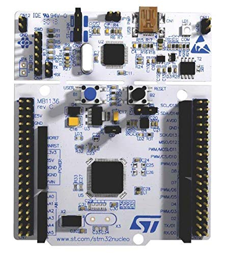

# ATWINC1500 WiFi Breakout with NUCLEO-L476RG

## Overview
This repository demonstrates the integration of **Adafruit's ATWINC1500 WiFi Breakout** with the **STM32 NUCLEO-L476RG** microcontroller from STMicroelectronics. The project provides example code to establish WiFi connectivity, showcasing the capabilities of the ATWINC1500 module when paired with the NUCLEO-L476RG. The code is developed using **STM32CubeIDE** and is designed to be adaptable for other STMicro MCUs and various WiFi security types (e.g., WPA2 PSK, WEP).

## Project Features
- Establishes WiFi connectivity using the ATWINC1500 WiFi Breakout.
- Configurable WiFi settings (SSID, password, security type) in `main.h`.
- Pinout configurations for the ATWINC1500 module defined in `winc_config.h`.
- Example code generated in STM32CubeIDE, compatible with the NUCLEO-L476RG.
- Modular design with clear comments in `main.c` and `main.h` for easy adaptation to other STMicro MCUs or WiFi security protocols.

## Hardware Requirements
- **STM32 NUCLEO-L476RG** development board
- **Adafruit ATWINC1500 WiFi Breakout**
- Jumper wires for connecting the ATWINC1500 to the NUCLEO board
- USB cable for programming and debugging the NUCLEO-L476RG

## Setup Instructions
1. **Hardware Connections**:
   - Connect the ATWINC1500 WiFi Breakout to the NUCLEO-L476RG as specified in the `winc_config.h` file, which contains the pinout details.
   - Ensure proper power and ground connections between the boards.

2. **Software Setup**:
   - Clone or download this repository.
   - Open the project in **STM32CubeIDE**.
   - Configure WiFi settings (e.g., SSID, password, security type) in `main.h` as per your network requirements.
   - Refer to the comments in `main.c` and `main.h` for guidance on modifying the code for other STMicro MCUs or WiFi security types.

3. **Build and Flash**:
   - Build the project in STM32CubeIDE.
   - Flash the compiled firmware onto the NUCLEO-L476RG using a USB connection.
   - Monitor the output via a serial terminal for debugging and status updates.

## Configuration Details
- **WiFi Settings**:
  - Modify the WiFi credentials and security type (e.g., WPA2 PSK, WEP) in `main.h`. Example:
    ```c
    #define MAIN_WLAN_SSID "YourNetworkSSID"
    #define MAIN_WLAN_AUTH M2M_WIFI_SEC_WPA_PSK
    #define MAIN_WLAN_PSK "YourPassword"
    ```
  - Follow the comments in `main.h` for supported security types and configuration options.

- **Pinout Configuration**:
  - The pin assignments for the ATWINC1500 are defined in `winc_config.h`. Ensure your hardware connections match these pinouts. Example:
    ```c
    #define SPI_WIFI_CS_PIN                      GPIO_PIN_4 
    #define SPI_WIFI_CS_GPIO_PORT                GPIOA
    #define SPI_WIFI_SCK_PIN                     GPIO_PIN_10
    #define SPI_WIFI_SCK_GPIO_PORT               GPIOC
    ```

- **Adapting to Other MCUs**:
  - The codebase is designed to be portable to other STMicro MCUs. Refer to the detailed comments in `main.c` and `main.h` for steps to modify pin assignments, peripheral configurations, and initialization routines.

## Photos
### NUCLEO-L476RG Board


### ATWINC1500 WiFi Breakout


## Usage
1. Power on the NUCLEO-L476RG with the ATWINC1500 connected.
2. The firmware will attempt to connect to the WiFi network specified in `main.h`.
3. Upon successful connection, the system can perform tasks such as sending/receiving data over WiFi, as demonstrated in the example code.
4. Check the serial output for connection status and debugging information.

## Contributing
Contributions are welcome! If you have improvements, bug fixes, or additional features (e.g., support for other WiFi modules or MCUs), please submit a pull request or open an issue.

## License
This project is licensed under the [MIT License](LICENSE).
